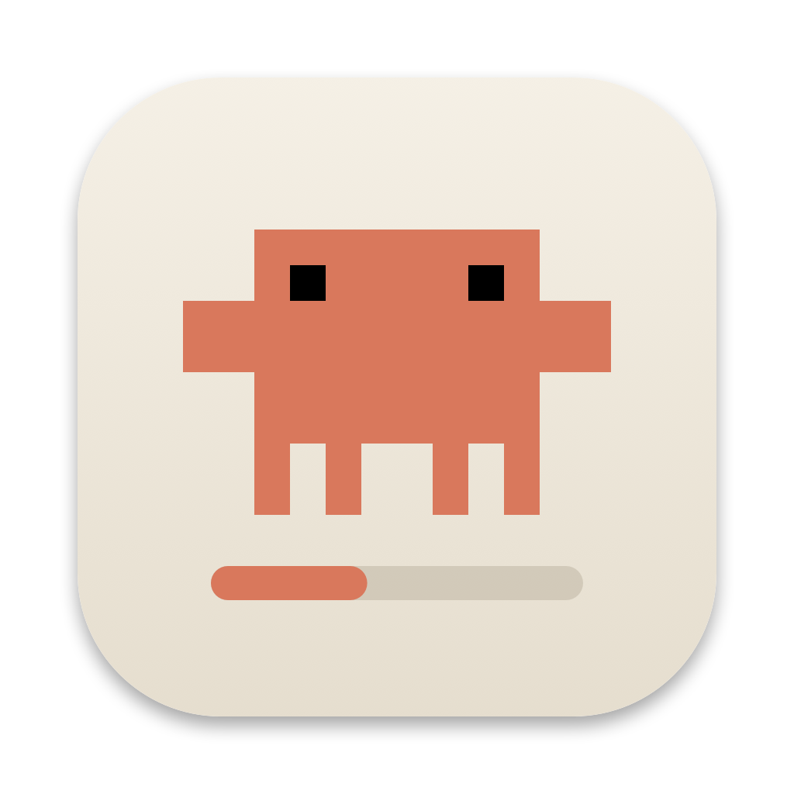
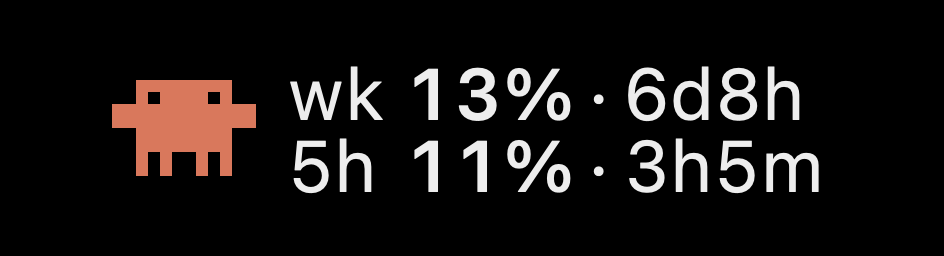
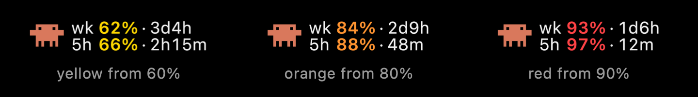

<p align="center"></p>

# ClaudeUsage

A tiny macOS menu bar app that shows your **Claude weekly and 5-hour usage limits** at a glance, with a little pixel mascot.

<p align="center"></p>

<p align="center"><em>The menu bar item (high-resolution render): weekly usage on top, 5-hour usage below, each with time until reset.</em></p>

- Weekly usage and time until it resets
- 5-hour usage and time until it resets
- Percentages turn yellow at 60%, orange at 80%, red at 90%
- Dropdown with exact reset times, an "at this pace" prediction (like the Claude app's usage page), and when it last/next refreshed
- The mascot blinks, shuffles and waves now and then (click it for a reaction)
- Native Swift, a single ~150 KB binary, no dependencies. It polls every 5 minutes and is idle otherwise.

<p align="center"></p>

<p align="center"><em>Warning colors as you near a limit. Weekly and 5-hour usage are colored independently.</em></p>

## Install

Requires macOS 13+ and the Xcode command line tools (`xcode-select --install`).

```bash
git clone https://github.com/tobyadams87/claude-usage-menubar.git
cd claude-usage-menubar
zsh build.sh
open ClaudeUsage.app
```

Move `ClaudeUsage.app` to `/Applications` and tick **Launch at Login** in its menu if you want it to start automatically.

If you download a prebuilt zip instead, the app is only ad-hoc signed: right-click it and choose **Open** the first time.

## First launch

A small window opens at claude.ai. Sign in the normal way (Google, email code, SSO). If Google refuses to sign in inside the app, use **Sign In with Session Key…** in the menu and paste the `sessionKey` cookie from a browser where you're signed in to claude.ai.

## How it works and privacy

- Sign-in happens in a web view; only the claude.ai session cookies are kept, in **your own macOS Keychain** (service `ClaudeUsageMenuBar`). Nothing is sent anywhere except claude.ai.
- It calls the same internal endpoint claude.ai's Usage page uses (`/api/organizations/{id}/usage`). **This endpoint is undocumented and may change or break at any time.** If the menu shows "Unexpected response", it has probably changed. Issues and PRs welcome.
- **Sign Out** in the menu deletes the stored session.

## Disclaimer

This is an unofficial community project. It is not affiliated with, endorsed by, or supported by Anthropic. "Claude" is a trademark of Anthropic. Use at your own risk.

## Files

| File | Purpose |
|---|---|
| `main.swift` | The app: sign-in, polling, menus, About |
| `MenuBarArt.swift` | Draws the menu bar item (mascot and aligned rows) |
| `Projection.swift` | The "at this pace you'll run out..." prediction |
| `makeicon.swift` | Generates the app icon from the pixel mascot |
| `build.sh` | Builds and ad-hoc signs `ClaudeUsage.app` |

## Credits

Made by [@tobyadams](https://x.com/tobyadams) and Claude Code (Sonnet 5.5).

## License

[MIT](LICENSE)
